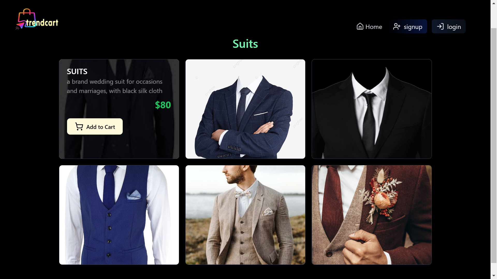
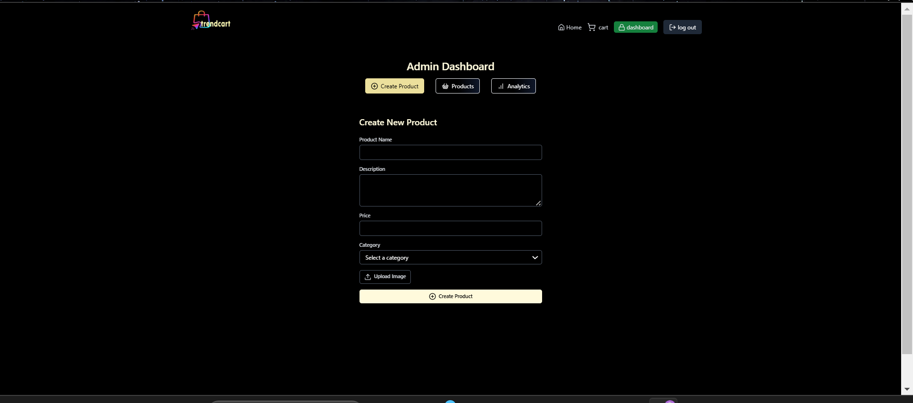
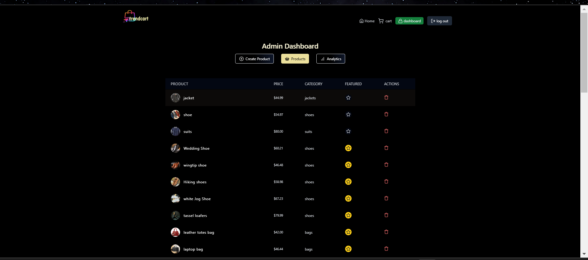

# MERN Stack Application

This project includes two roles: **Client** and **Admin**. The client role is assigned by default during registration. The admin role has exclusive features, which are accessible only by predefined admin users.

## Application Screenshots

### Client Role UI

  
  
  
  
  
  

### Admin Role UI

  
  
  
  

### Responsive UI

  
  
  
  
  
  
  

